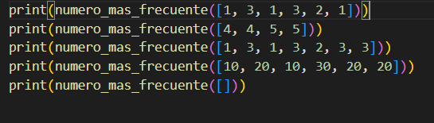
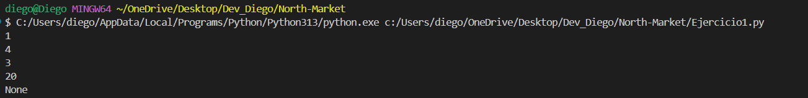
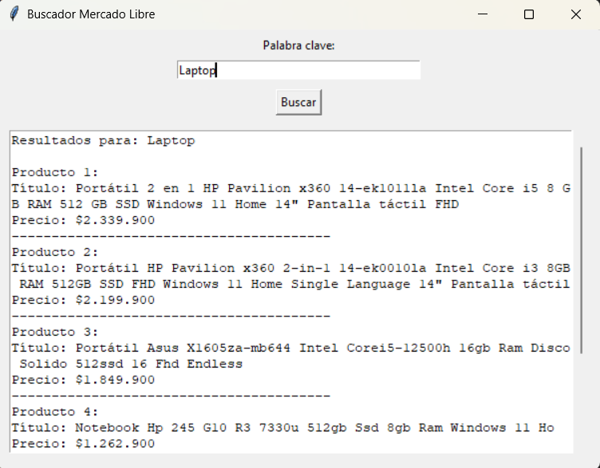
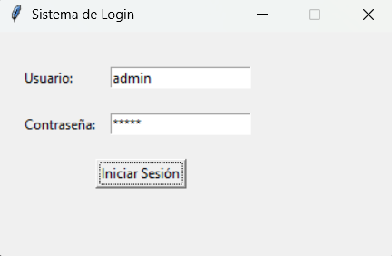
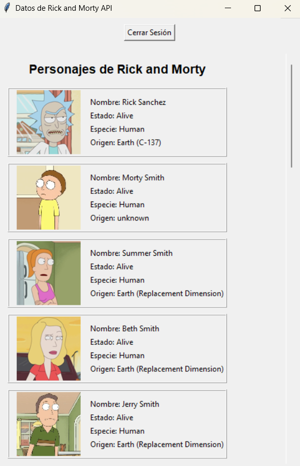
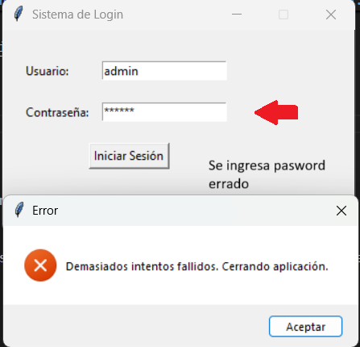

# Prueba Tecnica North-Market ✅


Este repositorio contiene tres ejercicios independientes desarrollados en Python. Cada uno puede ejecutarse desde consola y resuelve un caso práctico diferente, desde lógica básica hasta web scraping y consumo de APIs con GUI.


## ✅ Requisitos Generales

Antes de ejecutar los ejercicios, asegúrate de tener Python instalado (versión 3.7 o superior).

Instala las dependencias necesarias ejecutando en consola:

```bash
pip install requests beautifulsoup4 pillow
```


## 📘 Ejercicio 1: Número Más Frecuente
```bash
Archivo: `Ejercicio1.py`
```

Este script busca el número entero más frecuente en una lista y retorna el que mas se repita, en dado caso que hayan dos numeros con la misma frecuencia se escoge el numero menor.

###### ¿Cómo ejecutarlo, en consola?

```bash
python Ejercicio1.py
```

¿Qué hace?

- Imprime el número que más veces se repite en la lista predefinida dentro del código.
- Si hay un empate, devuelve el número menor.

##### Listas ingresadas


##### Salida por terminal



## 🛒 Ejercicio 2: Web Scraping de MercadoLibre

### Archivo: `Ejercicio2.py`

Este script abre una ventana con una barra de búsqueda. Al escribir un término (por ejemplo: “Laptop”) y hacer clic en "Buscar", muestra los primeros 5 resultados (título y precio).

###### ¿Cómo ejecutarlo, en consola?

```bash
python Ejercicio2.py
```

¿Qué hace?

- Usa scraping para buscar productos en MercadoLibre Colombia.
- Muestra título y precio en una interfaz gráfica simple (Tkinter).



¿Qué se espera?

- Aparece una ventana donde puedes ingresar un término de búsqueda.
- Al hacer clic en “Buscar”, aparecen los productos con su precio.

##### Ejemplo visual:

```bash
Resultados para: lapiz

Producto 1:
Título: Lapiz Pencil Tactil Para Apple iPad
Precio: $60.001
----------------------------------------
Producto 2:
Título: Lapiz Pencil Pro Para Apple iPad Palm Rejection
Precio: $60.233
----------------------------------------
Producto 3:
Título: Colores Faber Castell Supersoft X 100
Precio: $148.283
----------------------------------------
Producto 4:
Título: Lápiz óptico Linkon Stylus 10 iPad Color Blanco
Precio: $64.990
----------------------------------------
Producto 5:
Título: Difuminos X 6 Dibujo Arte
Precio: $8.900
----------------------------------------

```


## 🧪 Ejercicio 3: Login y Consumo de API

### Archivo: `Ejercicio3.py`

Este script presenta una ventana de login. Tras ingresar usuario y contraseña válidos, accede a la API de Rick and Morty y muestra personajes.

###### ¿Cómo ejecutarlo, en consola?

```bash
python Ejercicio3.py
```

###### Credenciales predefinidas (guardadas en `users.db`):
```bash
- Usuario: `admin`  
- Contraseña: `admin`
```
```bash
- Usuario: `usuario`  
- Contraseña: `password`
```
```bash
- usuario: `test`  
- Contraseña: `test123`
```

¿Qué hace?

1. Solicita usuario y contraseña.



2. Verifica credenciales con una base de datos SQLite.

3. Si el login es exitoso, abre una ventana con nombres e imágenes de personajes.



4. Si fallas 3 veces, el programa se cierra.



5. Se agrego boton de cerrar sesion.

¿Qué se espera?

- Ventana de login.
- Si ingresas las credenciales correctas, verás una ventana con personajes y sus imágenes.
- También se registra cada intento en `log.txt`.


📂 Estructura del Proyecto

├── Ejercicio1.py
├── Ejercicio2.py
├── Ejercicio3.py
├── users.db         
├── log.txt          
└── README.md


